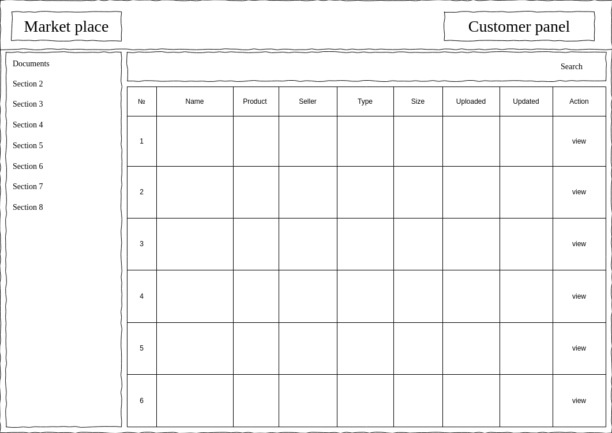
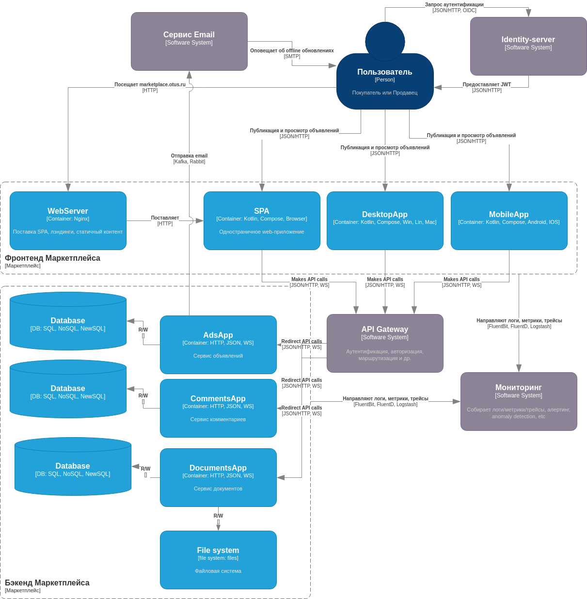
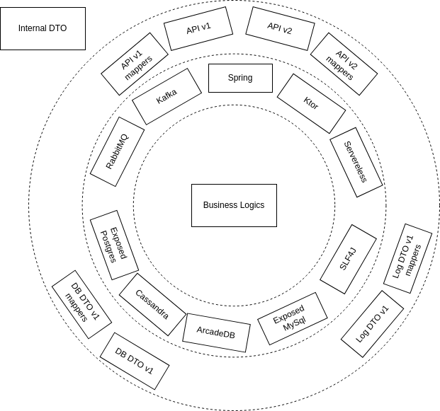
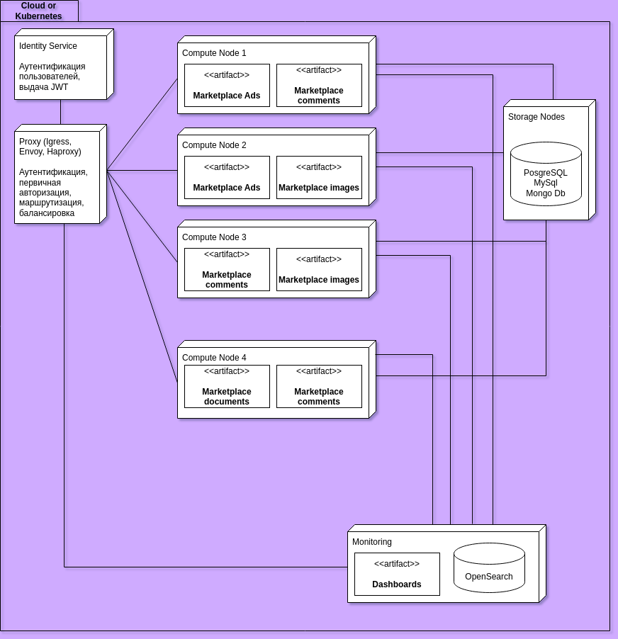

[En](README_en.md)
# Микросервис для управления карточками документов
### Описание проекта

**Documents** — это микросервис, предназначенный для создания, хранения, получения ссылок на карточки документов.

# ADR: Управление документами для продавцов и покупателей

## Контекст и постановка задачи
Продавцы должны иметь возможность создавать, искать, обновлять и удалять карточки документов.
Покупатели должны иметь возможность искать и просматривать карточки документов.
Необходимо определить наиболее эффективный механизм управления карточкой документа как для продавцов, так и для покупателей.

## Список бизнес-требований, которые решает проект
- **User Story 1: Управление карточкой документа**

## Список возможных решений
1. Создать панель управления карточками документов для продавцов и покупателей на платформе.
2. Интеграция с внешними облачными сервисами хранения данных. Ввести возможность хранения документов на внешних платформах, таких как AWS S3, Google Cloud Storage или аналогичные.

## Принятое решение
Выбрано решение 1: Создать панель управления документами для продавцов и покупателей на платформе.

## Обоснование решения
Этот вариант был выбран, так как панель управления документами предоставит интуитивно понятный интерфейс для
продавцов и покупателей, позволяя им легко загружать, обновлять, просматривать и скачивать документы.
Обе категории пользователей смогут напрямую взаимодействовать с системой, не изучая сторонние сервисы
или сложные интеграции. Управление документами на собственной платформе компании обеспечивает полный контроль
над процессами управления документами. Это позволяет устанавливать гибкие уровни доступа для продавцов и покупателей,
а также внедрять необходимые меры безопасности, такие как контроль доступа, без зависимости от внешних сервисов.

### Целевая аудитория

Этот микросервис предназначен для:

- **Продавцы**: Продавцам требуется система управления документами для внутренних операций, чтобы самостоятельно управлять документами, связанными с их продуктами, услугами и гарантийными условиями.
- **Покупатели**: Покупатели, которые нуждаются в документах для получения полезной информации о продуктах, услугах и гарантийных условиях.

### Портреты аудитории

- **Продавцы**:
  - **Пол**: Мужчины/Женщины
  - **Возраст**: 30-55 лет
  - **Местоположение**: Крупные города России или небольшие города с активным рынком товаров и услуг
  - **Профессиональный опыт**: Малый или средний бизнес, индивидуальные предприниматели, самозанятые, которые регулярно продают товары или оказывают услуги
  - **Доход**: Средний или выше среднего (от 70 000 рублей в месяц)
  - **Увлечения**: Предпринимательство, развитие бизнеса, технологии, путешествия, автомобили
  - **Зачем этот пользователь придёт к вам**: Продавцы хотят эффективно управлять документами, связанными с продажами (контракты, акты, счета). Сервис помогает легко загружать, хранить и предоставлять покупателям сопровождающие документы, что укрепляет доверие к сделкам и помогает избегать возможных споров.

- **Покупатели**:
  - **Пол**: Мужчины/Женщины
  - **Возраст**: 25-45 лет
  - **Местоположение**: Крупные города России (Москва, Санкт-Петербург, Новосибирск) или провинциальные районы с доступом к интернету
  - **Профессиональный опыт**: Специалисты среднего уровня или офисные работники, которые регулярно делают покупки в интернете
  - **Доход**: Средний доход (50-100 тысяч рублей в месяц)
  - **Увлечения**: Интернет-шопинг, автомобили, технологии, хобби (DIY, спорт, гаджеты)
  - **Зачем этот пользователь придёт к вам**: Пользователи хотят покупать товары или услуги быстро и безопасно через объявления и получать сопроводительные документы (квитанции, счета, контракты). Сервис упрощает хранение и доступ к этим документам, что важно для отслеживания расходов и обеспечения безопасности транзакций.

### Описание MVP

**Минимально жизнеспособный продукт (MVP)** этого микросервиса направлен на то, чтобы продавцы могли:

1. Создавать карточку документа.
2. Получать карточки документов по их идентификатору.
3. Удалять карточку документа из хранилища.
4. Обновлять метаданные, связанные с документами.
5. Искать документы.

Покупатели могли:

1. Получать документы по их идентификатору.
2. Искать документы.

### Эскиз интерфейса

Панель покупателя:

Панель продавца:

---

## API

#### 1. **Сущность документа** (document)

- **Атрибуты**:
  - `id` (Long): Уникальный идентификатор документа.
  - `title` (String): Исходное имя документа.
  - `description` (String): Описание документа.
  - `productId` (Long): Уникальный идентификатор продукта для доступа к документу. (product)
  - `ownerId` (Long): Идентификатор владельца, загрузившего документ. (seller)
  - `docType` (String): MIME-тип документа (например, `application/pdf`, `image/png`).
  - `size` (Long): Размер документа в байтах.
  - `uploadDate` (LocalDateTime): Время загрузки документа.
  - `updateDate` (LocalDateTime): Время обновления документа.
  - `filePath` (String): Путь, по которому хранится документ.

## Эндпоинты

1. CRUDS (создание, чтение, обновление, удаление, поиск) карточек документов (document)

---

### Архитектура

## Диаграмма контекста C4

---

## Диаграмма контейнеров C4

---

## Диаграмма компонентов C4

---

## Упрощенная (луковичная) диаграмма компонентов

---

### Devops

---

## Сетевая диаграмма для маркетплейса

